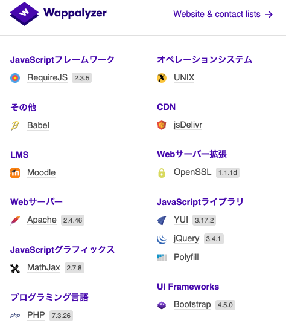

# investigate_moodle
moodleの調査

## 背景・目的

+ Learning Management Systemで使いやすいものがあるかを知りたい
+ 手始めに、moodleを使ってみる


## 環境構築

https://hub.docker.com/r/bitnami/moodle/

こちらのdocker hubを利用

### 事前準備

+ dockerコマンドを使えるようにする
+ docker-composeコマンドを使えるようにする

### dockerを起動

```
curl -sSL https://raw.githubusercontent.com/bitnami/bitnami-docker-moodle/master/docker-compose.yml > docker-compose.yml
docker-compse up -d
```

### 管理者でログイン

+ ID: user, Pass: bitnamiを使って管理者でログインできる


## moodleの仕組み


+ DB
  + MariaDB、PostgreSQL, MySQL, MSSQLなどが使える([参考](https://docs.moodle.org/310/en/Installing_Moodle))
+ 使っているフレームワーク

  


## moodleの特徴

+ レスポンシブデザインに対応していて、スマホでも問題なくみられる


# 参考資料

+ [moodleのgithub](https://github.com/moodle/moodle)
+ [moodleのドキュメント](https://docs.moodle.org/310/en/Installing_Moodle)


